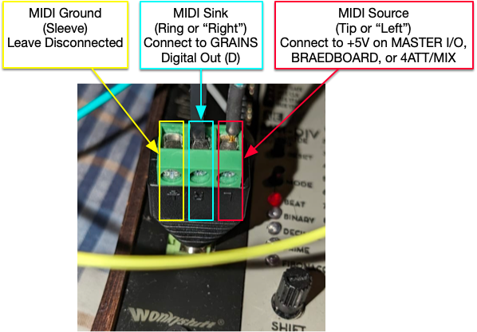
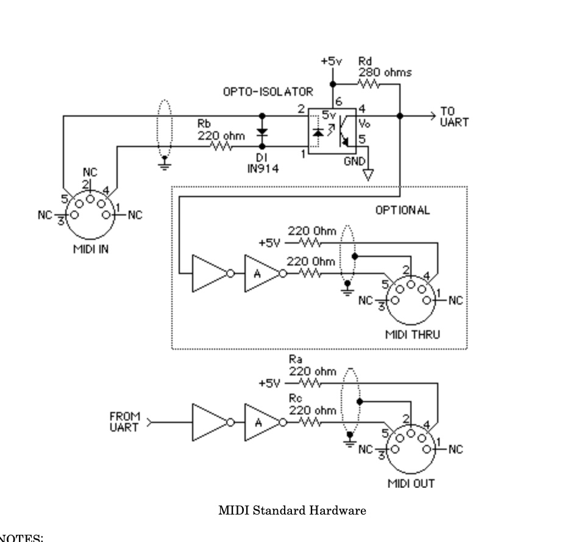

# Connecting GRAINS MIDI to your MB/1 or MASTER I/O 

While the WonkyStuff MB/1 has a great many MIDI OUT sockets, the WonkyStuff MB/1 and TangibleWaves MASTER I/O only have MIDI IN via their TRS jacks.  That is unfortunate.  It's highly desirable to connect Dave to them, particularly to the MB/1, to break out the MIDI it generates on a per-channel basis, to drive polyphonic module chains for example.  But how do you do this?

## FIRST A DISCLAIMER

I have so connected to the MB/1 and the MASTER I/O (R4) and both seem to work okay.  From discussion with both Tangible Waves and WonkyStuff, it seems that it's likely you won't hurt anything in these modes by
connecting to them, but **I WILL NOT BE HELD RESPONSIBLE** for any damage you incur trying this.

## Basic Information

Standard 5-pin DIN MIDI cabling only uses three wires, which MIDI calls the SOURCE, the SINK, and the GROUND.  The GROUND is just the shielding on the cable.  When synthesizer A is connected to send MIDI to synthesizer B, synthesizer A provides 5V on its SOURCE and provides the MIDI data on its SINK.  I know, it's not intuitive.  The idea is that as the MIDI data goes up and down, power is drawn from the SOURCE to drive an LED in synthesizer B's optoisolator, and goes out the SINK.

TRS MIDI is exactly the same as 5-PIN DIN MIDI: three wires.  However there are two versions, TRS A and TRS B.  They differ as to which wire is the source and which is the sink.  Both the MASTER I/O and the MB/1 use TRS B, in which the SOURCE is the TIP (or "LEFT") and the sink is the RING (or "RIGHT").  The ground is the SLEEVE.

## How To

All we need to do is connect 5V to the SOURCE (TIP) and connect the GRAINS's MIDI out to the SINK (RING).  We leave the ground (sleeve) DISCONNECTED.

To do this, you first need to buy a **3.5 mm Male TRS Screw Terminal Block**.  That's the magic term.  [Google for it](https://www.google.com/search?q=3.5+mm+male+TRS+Screw+Terminal+Block).  They're very cheap, like $5.

You can attach Dupont 0.1" cables or your nice TangibleWaves cables to the block.

The screw terminal block breaks out the TRS tip, ring, and sleeve to three wire screws so we can easily attach our two wires.  Here's the configuration I am using.  Note that my block says "L" (for "Left" -- the TIP), "R" (for "Right" -- the RING) and the Ground symbol for the Sleeve.  I have connected the GRAINS output to "R" and +5V to "L".  You can get +5V from current Master I/O units, or from modules 4ATT/MIX, or even directly from the bus cable itself if you're careful.  I'd make the +5V wire red to make it clear what's what.

Once you've hooked up the wires, you just plug the terminal block into the TRS socket.  Once again, I'm providing this information to early adopters, but **I WILL NOT BE HELD RESPONSIBLE** if this information is wrong and/or somehow you damage something.  Caveat Emptor.

## Why This Works

MIDI requires that there be certain resistors in place to prevent the LED in the optoisolator from frying from too much current:

- A 220 ohm or larger resistor in series with the SOURCE (Resistor Ra on the schematic below)

- A 220 ohm or larger resistor in series between the internal TRS jack and the optoisolator (Resistor Rb on the schematic)

- A 220 ohm or larger resistor in series with the SINK (Rc on the schematic)

All told this provides 660 ohms or more of resistance, more than enough to keep the optoisolator from being overrun.

Resistor Rb is built into the jacks already on the Master I/O and MB/1.  

### Connection from GRAINS DIGITAL Out is Safe
The 5V socket on the MASTER I/O, and the same from the BRAEDBOARD, have a 100 ohm resistor in series.  This isn't enough for Resistor Ra, but the SINK (the Digital OUT port on GRAINS) has a 1K ohm resistor in series.  All told this is 1320 ohms.  So we're fine there.

Alternatively, the 5V SOURCE from the 4ATT/MIX has a 1K ohm resistor, so that's 2220 ohms total, which should be plenty. 

### Connection from an MCO/1 or MB/1 Etc. is UNSAFE

However using the THRU on the MCO/1, MCC/4, etc., or any output from the MB/1 is **probably unsafe**.  The MB/1 has no resistor, and the MCO/1 etc. have a 100 ohm resistor only.

In short, this is the likely situation for SINKS and 5V SOURCES:

|                   | GRAINS Digital Out | MCO/1, MCC/4, etc. | Any MB/1 Output  |
| ----------------- | ------------------ | ------------------ | ---------------- |
| **MASTER I/O 5V** | 1320 Ohms: Safe    | 420 Ohms: Unsafe   | 320 Ohms: Unsafe |
| **BRAEDBOARD 5V** | 1320 Ohms: Safe    | 420 Ohms: Unsafe   | 320 Ohms: Unsafe |
| **4ATT/CV 5V**    | 2220 Ohms: Safe    | 1200 Ohms: Safe?   | 1100 Ohms: Safe? |

The MIDI schematic has a diode for reverse polarity if you mix things up (but don't do that).  I have swapped the two wires several times with no ill effects, fingers crossed.

### Connection from WonkyStuff THRU on MCO/1, MCC/4, or the MB/1 OUT is NOT Safe with a MASTER I/
The MB/1 has a 100 Ohm resister at the SINK.  
The MCO/1 has a MIDI Thru which provides 220 ohms per the spec.  This is the SINK.   If you use the MASTER I/O or BRAEDBOARD 5V as the SOURCE, that will only total to 540 ohms, not 660.  It probably would be just fine, but I'd not risk it without adding another resistor in-line.  Similarly, the various MIDI out sockets on the MB/1 are probably 220 ohms, with the same issue.

